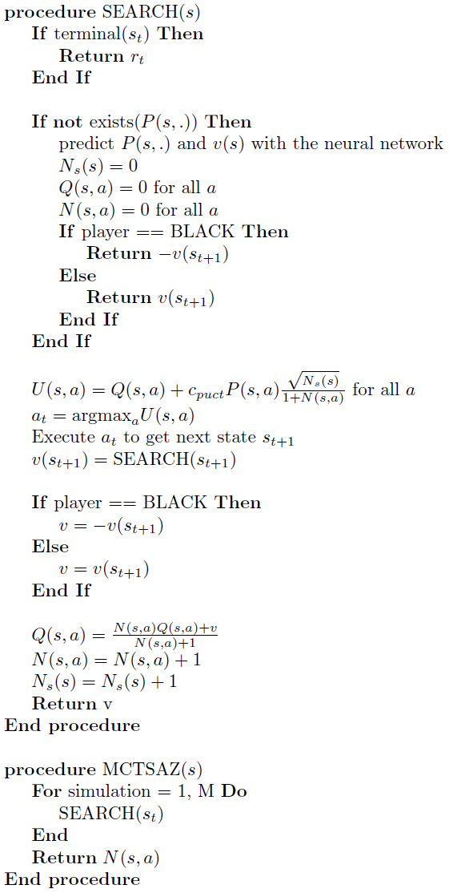
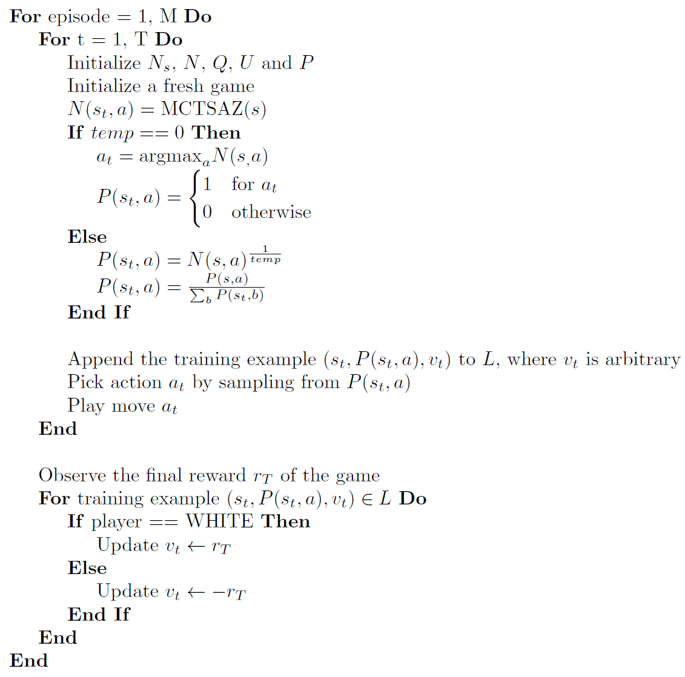

# Reinforcement Learning with Tic Tac Toe

## Goal of this Project 
The idea of this project is to try out different reinforcement learning algorithms to learn the game Tic Tac Toe. Tic Tac Toe is easy to implement and has a small state space. This is why the training of the neural networks will be fast. The goal is to use successful algorithms for more complex games such as Othello or Chess.
The different algorithms are in the folder called rl. Each subfolder contains a different reinforcement learning algorithm. In order to run the algorithms  
- run MainSelfPlayTraining.py to learn an agent how to play the game  
- run MainTestPlay.py to let the agent play against a random opponent

## Implementation Details
Tic Tac Toe is theoretically solved which means that there exists an optimal strategy that will win or at least draw against any strategy of the opponent. Furthermore, the state space is small and tabular learning could be used but since I want to use these algorithms for more complex games a neural network is used for function approximation. The performance of the agent is measured against an opponent that just plays random moves. 

The following strategies were used in all algorithms:  
- The reward of the agent is 1 if white wins, -1 if black wins and 0 if the game is still running or drawn  
- Evaluation: The reward is 1 for winning, 0.5 for draw and 0 for losing.  
If two random players are playing against each other white will score about 0.65 and black 0.35. These are the baselines to check if the network has learned something.

## Algorithms based on the Value Function
Since Tic Tac Toe is a zero sum game with perfect information it is possible to only look at the afterstates to figure out the best move from a given position. With this approach only one agent needs to be trained. In a given position all possible moves are played and the value of the successor position is calculated. The move with the highest value is chosen if the agent makes a move for white and the lowest value is chosen if the agent makes a move for black. This move is called the greedy move.  
q(s,a) = argmax V(succ(s,a)) for white
q(s,a) = argmin V(succ(s,a)) for black

The value function V is approximated by a neural network which takes the board configuration as input. The board is represented by a vector of size 18. The first 9 elements are the white pieces and the second 9 elements are the black pieces. The player that is about to move is a feature that was added in the third layer of the neural network. The feature is 0 if it is white's move and 1 if it is black's move. The neural network has only a single number V(s_t) between -1 and 1 as output that tells us how good it is to be in the current position. 1 means that white is winning and -1 means that black is winning. A value of 0 means that the position is estimated as equal. 

### TD(0) Learning
- Training of a neural network with correlated data tends to be unstable. Additionally, as the agent is learning his policy changes as well. The target to learn is therefore not stationary and convergence is not guaranteed. For this reasons the following stabilization strategies were chosen:
- replay experience: after a move was made the state transition is saved in a buffer. In every training step a batch is randomly chosen from this buffer. The batch is used to train the network in one stochastic gradient decent step
- two networks were used. A target network which is used to calculate the value function and a training network on which the training steps are performed. The target network is periodically synchronized with the training network after some time steps
- The state transitions that were induced by picking a random exploratory move were not considered in the neural network update

The algorithm is given by,

The ideas of this approach were taken form:  
- Reinforcement Learning - An Introduction [book](http://incompleteideas.net/book/bookdraft2017nov5.pdf)    
- Online [Lectures](https://www.youtube.com/watch?v=kZ_AUmFcZtk&list=PLqYmG7hTraZDM-OYHWgPebj2MfCFzFObQ&index=10) from David Silver

### TD(&lambda;) Learning
This [paper](https://arxiv.org/abs/1810.09967) introduced a new reinforcement learning algorithm that uses eligibility traces combined with an experience buffer in an efficient way. Because eligibility traces are used learning is much more efficient for longer games. Since Tic Tac Toe is a very short game with a maximum of 9 moves the difference is not that big but for a game like Othello that has a maximum of 60 moves it makes a huge difference. The algorithm was adapted for the self-play context as follows:

## Algorithms based on the Action Value Function
The action value function Q(s,a) describes the expected reward given a state and an action. The best action (greedy move) can be found by choosing the action with the maximal action value for white and the minimal action value for black. The action value function V is approximated by a neural network which takes the board configuration as input. The board is represented by a vector of size 18. The first 9 elements are the white pieces and the second 9 elements are the black pieces. The neural network has an vector of size 18 as output. The first 9 elements are the white action values and the second 9 elements are the action values for black. To find the greedy move illegal moves are not considered.  

Theoretically it could be possible to only have 9 action value outputs of the network which corresponds to setting a stone for black or for white. There are two problems with this architecture that's why the architecture of 18 action values was chosen:  
- In the following board position:  
. xx  
. . .  
. oo  
it is not obvious what the best move is. If it is x's move the best move would be to play in the upper left corner. If it is o's, the best move is to play in the bottom left corner.  
- The problem above could be bypassed by representing the board always from the white perspective. If it is whites move the first 9 elements of the vector representing the board are the white disks and the second 9 elements are the black disks as described above. If it is blacks move the white and the black disks are swapped, which means that the first 9 board vector elements are now the black disks and the second 9 elements are the white disks. However, this approach will lead to a different problem. During training the network never loses. The last player who is about to move will always make a winning move or a drawing move. It is not possible to play a move and immediately lose the game without the opponent playing an additional move. The training examples of the neural network would therefore only consist of winning and drawing positions which results in the network not learning properly. 

### Q-Learning
The same strategies as in TD(0) Learning were used:  
- experience replay
- separate target and training networks
- exploratory moves were not considered as training examples

The algorithm is given by,

The ideas of this approach were taken form:  
- DQN [paper](https://web.stanford.edu/class/psych209/Readings/MnihEtAlHassibis15NatureControlDeepRL.pdf)  
- Reinforcement Learning - An Introduction [book](http://incompleteideas.net/book/bookdraft2017nov5.pdf)    
- Online [Lectures](https://www.youtube.com/watch?v=kZ_AUmFcZtk&list=PLqYmG7hTraZDM-OYHWgPebj2MfCFzFObQ&index=10) from David Silver

### DQN(&lambda;)
The idea of using eligibility traces in deep Q-networks can be found in this [paper](https://arxiv.org/abs/1810.09967). As mentioned above using eligibility traces makes learning is much more efficient for longer games. In Q-learning the reward propagates only one position back. By using eligibility traces the reward is used to update all positions in one episode at once. The algorithm was adapted for the self-play context as follows:

### AlphaZero
Alpha Zero is the current state of the art reinforcement learning algorithm for board games developed by Google DeepMind. The ideas presented below are taken from this [paper](https://arxiv.org/abs/1712.01815) and from [this](https://web.stanford.edu/~surag/posts/alphazero.html) implementation. To train an agent absolutely no human knowledge is needed apart form the rules of the game. To master complex games like chess or Go a huge amount of computational power is needed and currently not doable on a single computer. Tic Tac Toe is so simple that it can be trained within reasonable time using the Alpha Zero algorithm. Below is a high level overview of how the algorithm works before going into the details:  
- Get some training examples by letting the training network play against itself (self-play) by using a modified Monte-Carlo Tree Search (MCTS)
- Use the generated training examples from the self-play to train the network  
- Optional: Let the training network play against the current best network. If it reaches at least a certain score, the training network will become the best network. If not, the steps above are repeated. This step was removed in the latest version of the AlphaZero paper. Therefore it is marked as optional.

#### *The neural network*
DeepMind used a deep convolutional residual neural network. Here only a simple neural network with fully connected layers is used. The input of the network is the current game state from the white perspective. In this project the Tic Tac Toe board is represented with a vector of size 18. If it is white's move the first 9 elements represent the white pieces and the second 9 elements represent the black pieces. If the current player is black the white and the black pieces are swapped (first 9 elements represent the black pieces and the second 9 elements represent the white pieces). This way the neural network gets the state of the games always presented from the white perspective.  
After a few layers the architecture of the network will split into two heads, a policy and a value head. The policy output of the network consists of a vector describing the probability over all possible actions. For Tic Tac Toe this is a vector of 9 as the board is always viewed from the white perspective. Illegal moves are ignored later on and the probabilities are normalized again. The value output of the network is a continuous value between -1 and 1 representing the outcome of the game for the current player where -1 means loss, 0 means draw and 1 means win.
 

#### *Monte-Carlo Tree Search*
Monte-Carlo Tree Search is a heuristic search algorithm. The idea is to treat the game like a tree. The current state of the game is the root node. By taking legal moves nodes of the tree can be reached that each represent a legal game state. Theoretically the whole tree of the game could be expanded to find the optimal move for the current state (Minimax algorithm). This is possible for very small games such as Tic Tac Toe but for larger games this is simply not doable. In pure Monte-Carlo search you would just play a number of rollouts (make simulations until you reach the end of the game). The moves are picked randomly. After the rollout were performed you choose the move with the highest win probability. After you reached the new position you repeat the process. If you make an infinite number of simulations this strategy will lead to best play. In games with an exponential growing tree such as chess it will not lead to good results as far too many simulations are needed.  

On improvement is to use an upper confidence bound during the tree search given by,  
  

During the tree search you always pick the action with the highest upper confidence bound. This ensures a balance between exploration and exploitation. The upper confidence bound is high for nodes that have not been visited often or nodes that have a high expected reward. At the end of the simulation the action with the highest probability to win is picked (i .e. the action with the largest Q(s,a)) and a new simulation is started. By increasing the constant c_puct, the exploration term becomes more important and actions that were not visited a lot have a high upper confidence bound and are therefore more likely to be chosen. If c_puct is small exploitation dominates (i. e. high expected values Q(s,a) are the most important). MCTS works in a way that good moves are visited more often and give a good indication of what moves should be played (see Training Algorithm). A more detailed explanation and some code examples can be found [here](https://jeffbradberry.com/posts/2015/09/intro-to-monte-carlo-tree-search/).  
  
AlphaZero improved the MCTS further by using a different version of the upper confidence bound called the polynomial upper confidence trees (PUCT):

The MCTS that is used by Alpha Zero uses the network to predict the probabilities of an action to play. The algorithm to search one state is given by,

For every game state s we execute the procedure MCTSAZ(s) which returns N(s,a). This is the number of times an action $a$ was chosen in state s. See below how this procedure is used during training.

#### *Training Algorithm*
We now have all the pieces to understand the actual Alpha Zero training algorithm:  
- Randomly initialize the weights of the neural network  
- Keep a copy of the network. Lets call it reference network. The reference network is the current best network of the training process.  
- *Self-Play*: In order to train the neural network we need training examples that are generated by self-play:

   

Executing the algorithm above we will get one training example after every move. The temperature can be kept > 0 for the whole game or it can be set to 0 after a few moves were played.   
- *Training*: After a few self-play games were played the training examples are used to train the training network. One example consists of (s, P, v), the state of the game s, the policy P and the value v. 
- *Evaluation*: Let the training network play against the reference network. The games will be played exactly like the self-play games with the difference that the temperature will always be set to 0. This means that the network will play deterministically. If the training network reaches a certain score (e. g. 0.55) a copy of the training network is kept, which will be the new reference network for the next evaluation. If the training network can not beat the reference network it will be trained further.

The three steps described above are just repeated and eventually a very strong agent will be created. 
 
